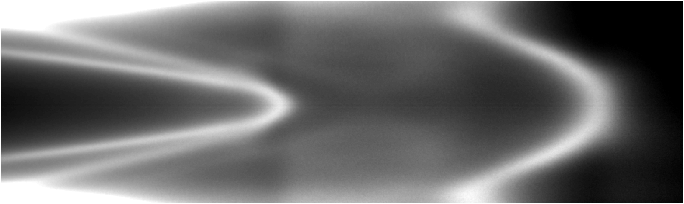

**Researchers from C2N and University of Pennsylvania in collaboration with CASSIOPÉE and TEMPO beamlines found a reliable method to tune the electronic properties of 2D TMDs materials without quality degradation. In particular, they demonstrated that  the electronic properties of single layer MoS2 con be tuned from electron (n) to hole (p) doping via controlled exposure to atomic hydrogen at room temperature.**

Following similar trend as graphene, the two-dimensional (2D) transition metal dichalcogenides (TMDs) have attracted much interest recently thanks to their versatile electronic and optical properties. However, unlike graphene that does not have a bandgap, they exhibit attractive properties such as indirect-to-direct bandgap crossover with decreasing number of atomic layers and strong photoresponses. In contrast to  graphene where only small bandgap (few hundred meV) can be opened by strain and other methods, large bandgap tunability can be obtained with 2D TMDs where we can switch from a semiconducting (with a few eV bandgap) to a metallic form. This large tunability allows broadening the applications of TMDs in nanoelectronic devices. Furthermore, the presence of defects can induce deep gap states responsible for the intrinsic doping of these materials. For instance, in the case of MoS2, sulfur mono-vacancies represent the defects with the lowest formation energy and the most common generally present in MoS2 flakes. In particular, these sulfur vacancies (Sv) cause the presence of unsaturated electrons in the surrounding Mo atoms and act as electrons donors responsible for the n-type doping of MoS2. The introduction of dopants in MoS2 lattice represents a potential route to achieve stable MoS2 with different functionalities. Therefore, it is crucial to develop controllable techniques to make possible the tunability of MoS2 properties without degrading the quality of MoS2 flakes.

In this work, an easy and effective chemical doping method by hydrogen atoms is reported, and the scientists show that hydrogen represents an effective way to passivate sulfur vacancies.

Study of the electronic properties of the hydrogen-doped MoS2 on TEMPO beamline

HR-XPS studies on TEMPO beamline reveal the n type doping of pristine single layer MoS2 which is also confirmed by the measurement of the valence band maximum (VBM). In Figure 1(a) the evolution of the characteristic core level peaks of MoS2 (Mo 3d and S 2p) are shown, from the pristine MoS2 through three different hydrogen doses. After the hydrogen doses the core level peaks of Mo 3d and S 2p show a rigid shift to lower binding energies (BE) (1st dose = -0. 1 eV, 2nd = -0.3 eV and 3rd = -0.5 eV) and the peak related to the sulfur vacancies (Sv) completely disappear indicating a complete saturation of the Sv. The saturation of these vacancies gradually reduced the n-type doping of the MoS2 decreasing the distance of the VBM to the Fermi level (FL) as shown in Figure 1 (b) from 1.25 eV for the pristine MoS2 to 0.95 eV (almost mid-gap, considering a quasi-particle bandgap of 2 eV) for the second hydrogen dose. This is the cause of the rigid energy shift of all core-levels. When the hydrogen dose is further increased the core level peaks still shift toward lower binding energy (-0.5 eV), which correspond to a distance of the VBM to the FL of about 0.75 eV. This means that a p-type doping is now induced in the MoS2 flakes. The formations of Mo-H bonds and the saturation of the Sv replace the donor gap state present in the pristine MoS2 to new acceptor gap state related to the Mo-H bond formation as confirmed by DFT calculations.

###Link to Publication
---

Pierucci, D., Henck, H., Ben Aziza, Z., Naylor, C.H., Balan, A., Rault, J.E., Silly, M.G., Dappe, Y.J., Bertran, F., Le Fevre, P., Sirotti, F., Johnson, A.T.C., Ouerghi, A. *Tunable Doping in Hydrogenated Single Layered Molybdenum Disulfide* [ACS Nano](https://pubs.acs.org/doi/10.1021/acsnano.6b07661), **11**, 1755–1761 (2017)

###Link to the Highlight
---

This highlight was published on Synchrotron SOLEIL [website](https://www.synchrotron-soleil.fr/en/news/reliable-method-tune-2d-transition-metal-dichalcogenides-tmds-doping-without-quality).
