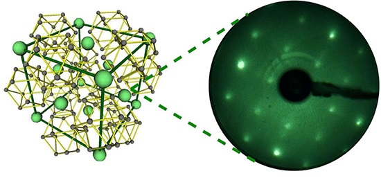
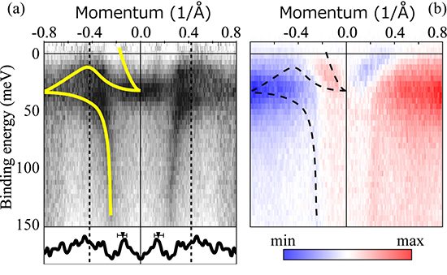

**Angle-resolved photoemission measurements on YbB12 carried out on CASSIOPEE beamline evidenced the existence of a metallic surface state. The obtained results strongly suggest the topological origin of this surface state driven by the Kondo effect and suggest that YbB12 would be a topological Kondo insulator.**  

Unlike the inside of a crystal, or the bulk, where atoms align in a regular pattern, various unique phenomena occur on the surface of a crystal, and, not surprisingly, these phenomena are affected by the bulk as well. Of such physical phenomena, a Topological Surface State (TSS), whose properties are determined by the symmetry of the electronic state in the bulk, is drawing attention.

The TSS shows that current flows without being affected by fine atomic structures and by contamination on the crystalline surface and that spin orientation varies depending on the flow of electrons even if the bulk has no magnetism. Research was actively performed in order to apply the TSS to next-generation semiconductors for spintronic devices, and electronic correlation effects on the TSS in particular have been discussed in recent years.

Strong electronic correlation effects cause various phenomena such as high-temperature superconductivity and giant magnetoresistance in the bulk. Various new physical phenomena due to the combination of these phenomena and the TSS are theoretically predicted. In particular, it has been theoretically predicted that a synergistic effect between strong electron correlation and spin–orbit interaction could realize new topological states of quantum matter on Kondo insulators* (KIs), so called topological Kondo insulators (TKIs). However, researchers face difficulty experimentally generating the TSS, which is closely involved in strong electronic correlation effects. Nevertheless, one particular insulator, samarium hexaboride (SmB6), which undergoes the phase transition from metal to semiconductor via the Kondo Effect at low temperatures, was reported as a possible TKI. On the other hand, since some researchers interpreted the surface electronic state of SmB6differently, it was unclear whether or not SmB6 was really TKI or if there existed a TSS that would appear through electronic correlation.

A group of researchers from Osaka University, the Institute for Molecular Science, the Institute of Materials Structure Science, High Energy Accelerator Research Organization, the Hiroshima Synchrotron Radiation Center, Ibaraki University, and Synchrotron SOLEIL (CASSIOPEE beamline) developed the new method to obtain atomically flat, well-defined and clean surface of a single crystal of rare-earth ytterbium boride (YbB12) and examined its surface electronic state by measuring spins and orbital symmetry based on angle-resolved photoelectron spectroscopy (ARPES).

Figure 1 shows the low-energy electron diffraction (LEED) pattern observed after the cleaning process. As shown by the sharp spots and low backgrounds, a well-ordered clean YbB12(001) surface was obtained. In addition to the integer order spots corresponding to a (001) in-plane lattice constant, fractional order spots showing additional surface superlattice were also found. The pattern shows fourfold rotation symmetry, which is expected from the bulk crystal structure (see the left side of Figure 1)

  {.center}

__Figure 1: (left) Atomic structure of YbB12 crystal. Green (gray) circles are Yb (B) atoms. (right) Low-energy electron diffraction pattern from the YbB12 clean surface. Sharp and bright spots indicates clean and well-ordered surface.__

Figure 2 is the ARPES results showing surface electronic structure. As indicated by the yellow guide in Fig. 2 (a), the metallic state was clearly observed to connect continuously to bulk bandgap. The bulk electronic structure of YbB12 cannot host such metallic states dispersing across the Kondo gap and hence this metallic state is derived from the surface electronic structure. Moreover, circular-dichroism of ARPES performed at CASSIOPEE beamline indicated the helical orbital polarization of the metallic surface state, which is closely related to the spin polarization. These results strongly suggest the topological origin of the surface states of YbB12 driven by the Kondo effect.

  {.center}

__Figure 2: (a) Energy vs momentum plot of YbB12 surface electronic states. Dark area shows electron intensity. Yellow line is a guide to the eye of the surface state dispersion and the lower window is the momentum distribution curve at 0-meV binding energy. (b) Orbital angular momentum polarization structure obtained by circular dichroism of ARPES. Red/blue area represents the polarization along the opposite direction to each other. Dashed line represents the surface-state dispersion shown in (a)__

**Note: Kondo effect and Kondo insulator**  
In some rare-earth based intermetallic systems, the coexistence of unfilled 4f states and of conduction electrons can lead to the apparition of the Kondo effect. Indeed, the 4f electrons are very localized on the rare-earth ion sites and if these states are partially filled, they form a very localized magnetic moment. On the other hand, the conduction electrons are completely delocalized and they can be scattered by the 4f magnetic moments. At high temperature, these interactions do not have consequences but, when the temperature is decreasing, these interactions become much more important as compared to the other energy scales. One can define the Kondo temperature which is the temperature below which a strong coupling appears between magnetic moments and conduction electrons forming non-magnetic quasi-particles (antiferromagnetic coupling) with a very large effective mass denoting the trapping of the conduction electrons. In solid state theory, the trapping of the conduction electrons below the Kondo temperature, corresponds to the opening of a gap at the Fermi energy in the band structure and to the appearance of an insulating phase.

###Link to Publication
---

__Kenta Hagiwara, Yoshiyuki Ohtsubo, Masaharu Matsunami, Shin-ichiro Ideta, Kiyohisa Tanaka, Hidetoshi Miyazaki, Julien E. Rault, Patrick Le Fèvre, François Bertran, Amina Taleb-Ibrahimi, Ryu Yukawa, Masaki Kobayashi, Koji Horiba, Hiroshi Kumigashira, Kazuki Sumida, Taichi Okuda, Fumitoshi Iga and Shin-ichi Kimura__  
*Surface Kondo effect and non-trivial metallic state of the Kondo insulator YbB12*  
[*Nature Communications* **7**, 12690 (2016)](http://www.nature.com/ncomms/2016/160831/ncomms12690/full/ncomms12690.html) - [Pre-Print](https://arxiv.org/abs/1602.08173)

###Link to the Highlight
---

This highlight was published on Synchrotron SOLEIL [website](https://www.synchrotron-soleil.fr/en/news/ybb12-new-topological-kondo-insulator).
