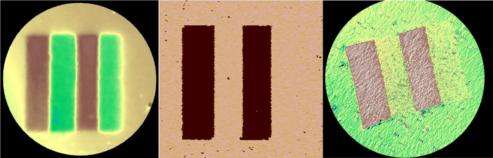
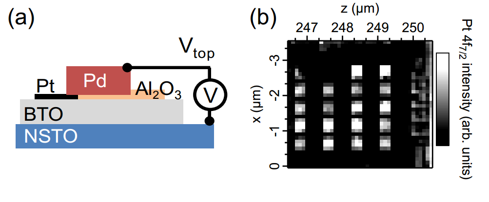
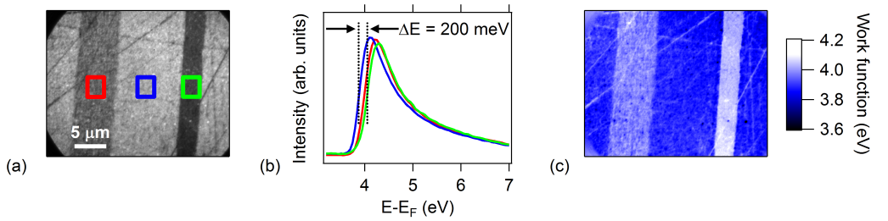
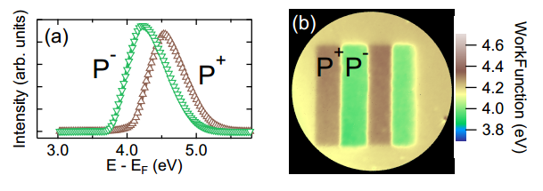

**Ferroelectric memory devices could be an alternative to magnetic based memories for future high-density data storage. Such devices have considerable advantages: they are non-volatile, have fast read-write times, low energy consumption and use realistic voltages. However, before considering future applications based on such materials, a better understanding of the electronic properties of nanometer-thick ferroelectric films is necessary. As this characterization is often impossible with standard techniques, scientists from IRAMIS/SPCSI (CEA), Institut des Nanotechnologies de Lyon (ECL), UMRPhys CNRS/Thalès, Arkansas University and Institut d’Electronique Fondamentale (Université d’Orsay) have studied ultra-thin films of ferroelectric materials on the TEMPO beamline, using both photoelectron spectroscopy and microscopy, an ideal tool for this kind of analysis.**

In a ferroelectric device the local electric polarization is used to store information, either directly (FeRAMS) or by controlling another binary material state (resistive memories). 
The defining property of a ferroelectric (FE) material is a spontaneous macroscopic polarization which can be reversed under an applied electric field. Switching the polarization of such films requires a metallic contact, raising fundamental issues on the behavior of the interface between the FE layer and the electrode. The polarization leads to fixed charge of opposite sign at the two metal-FE interfaces. Free charge carriers in the metal electrodes act to screen the polarization charge, however, the screening is usually imperfect and the residual depolarizing field inside the FE alters the electrostatic potential and can even suppress FE polarization below the so-called critical thickness.

## Probing metal/FE interface electronic response to ferroelectric switching ##

Using X-ray Photoemission Spectroscopy (XPS) with in-situ bias application, scientists from IRAMIS/SPCSI, Institut des Nanotechnologies de Lyon and Institut d’Electronique Fondamentale have directly measured the band alignment and the electronic structure of BaTiO3 (BTO) near the Pt/BTO interface in a Pt/BTO/SrTiO3:Nb heterostructure. Electrodes 300 × 300 μm² wide and 3 nm thick were patterned by ion beam etching. Thicker palladium pads overlapping part of the Pt electrodes were deposited to enable wire-bonding of the top electrodes to the sample holder. A highly insulating layer of Al2O3 was deposited onto bare BTO to suppress interference of the Pd pads with the capacitance (Figure 1a). At the TEMPO beamline, the 100 × 100 µm² beam could be directed onto a single top electrode located by a map of the whole sample using the Pt absorption edge (Figure 1b).

__Figure 1: (a) Schematic of the capacitor; (b) Pt 4f intensity map for the Pt/BTO/NSTO sample showing 20 identical Pt/BTO/NSTO capacitors (300x300 µm²) on the 5x5 mm² surface, allowing location of the wired capacitor.__

In the P+ state (FE polarization towards Pt), the structure can be modeled as back-to-back diodes showing Schottky-limited conduction. Indeed, the experimental conduction-band offset is 0.40 eV at the Pt/BTO interface and 0.45 eV at the BTO/NSTO interface. In the P- state (FE polarization towards NSTO), the top interface band alignment stays Schottky-like (+0.90 eV) while at the bottom interface the conduction band offset reduces to zero leading to ohmic conduction, in agreement with Current – Voltage characterization of the whole structure. The observed barrier heights depend on both the interface chemistry and the FE polarization (ref. 1).

Using the time-resolved detection system available at TEMPO beamline, the temporal photoemission response of the capacitor to polarization switching induced by square voltage pulses has been measured. An equivalent circuit model is used and has a behavior which compares well with the photoemission results on the system. This shows the potential of time-resolved photoemission spectroscopy to follow the chemical/electronic changes in working model microelectronic devices, here a ferroelectric capacitor (ref. 2).
The next step is in-operando pump-probe measurements of the electron dynamics of the switch, focusing on the response of the ferroelectric near the electrode interface. Electronic pump with synchrotron based XPS probe is the ideal tool and appears well-suited to the time-resolved capabilities of TEMPO.

## Mapping the polarization of ultra-thin ferroelectric films ##

The existence of a critical thickness for the stabilization of the ferroelectric state is of utmost importance for future applications based on nanometer-thick films. However, standard electric characterization, namely polarization-field hysteresis loops, of ultra-thin films is often impossible because of leakage currents. Photoelectron Emission microscopy (PEEM) offers an original solution to this problem because it is very sensitive to the surface potential and hence to surface charge differences, for example between P+ and P- domains. Spatial correlation of the surface potential, chemistry and band structure may be achieved on scales compatible with real devices. 
For example a BaTiO3(001) single crystal have been studied using energy-filtered threshold PEEM on TEMPO beamline. The threshold spectra for the regions of interest indicated by the rectangles show there are three distinct photoemission thresholds. Performing a pixel by pixel analysis, fitting the shape of each threshold spectrum independently gives the threshold map whose values correspond to domains (in order of decreasing threshold) with polarization pointing out from the surface into vacuum, along the surface and into the surface. Thus, energy-filtered PEEM can accurately map the distribution of polar domains at the surface (Figure 2; ref. 3).

__Figure 2: (a) Energy-filtered, threshold image of a BTO (001) single crystal showing three main intensity levels. (b) Threshold spectra as extracted from the (solid) rectangles in (a). (c) Photoemission threshold map obtained using a pixel-by-pixel fit to the threshold spectra.__  

Ultra-thin films of BiFeO3 have been grown on (La, Sr)MnO3/SrTiO3(001) at the UMPhys CNRS/Thalès. Micron-sized regions have been poled using piezo-response force microscopy. Threshold PEEM emission gives a direct, non-contact estimation of the film polarization (Figure 3). Below 5-7 nm the film polarization falls to zero. However, X-ray diffraction shows that the tetragonal distortion is constant; therefore the zero polarization cannot be due to structural modifications as predicted by continuous medium theory. First principles based effective Hamiltonian calculations suggest that when the screening of the surface charge becomes too poor to maintain a single domain state, a transition to a nanoscale stripe domain phase takes place, giving a zero average polarization measured on the micron scale whilst conserving the tetragonal structure (ref. 4). The next challenge is the direct experimental observation of these nanoscale domains.

__Figure 3: (a) Threshold spectra extracted from P+ (upwards) and P- (downwards) domains (b) Work function map obtained from the threshold image series (70 nm thin film).__  

Link to Publications
---

__J. E. Rault, G. Agnus, T. Maroutian, V. Pillard, Ph. Lecoeur, G. Niu, B. Vilquin, M. G. Silly, A. Bendounan, F. Sirotti, N. Barrett__  
*Time-resolved photoemission spectroscopy on a metal/ferroelectric heterostructure*  
[*Physical Review B* **88**, 155107 (2013)](https://journals.aps.org/prb/abstract/10.1103/PhysRevB.88.155107) - [Pre-Print](https://arxiv.org/abs/1307.3769)

__J. E. Rault, G. Agnus, T. Maroutian, V. Pillard, Ph. Lecoeur, G. Niu, B. Vilquin, M. G. Silly, A. Bendounan, F. Sirotti, N. Barrett__  
*Interface Electronic Structure in a Metal/Ferroelectric Heterostructure under Applied Bias*  
[*Physical Review B* **87**, 155146 (2013)](http://prb.aps.org/abstract/PRB/v87/i15/e155146) - [Pre-Print](https://arxiv.org/abs/1302.4603)

__J. E. Rault, W. Ren, S. Prosandeev, S. Lisenkov, D. Sando, S. Fusil, M. Bibes, A. Barthélémy, L. Bellaiche, and N. Barrett__  
*Thickness-Dependent Polarization of Strained BiFeO3 Films with Constant Tetragonality*  
[*Physical Review Letters* **109**, 267601 (2012)](http://dx.doi.org/10.1103/PhysRevLett.109.267601) - [Pre-Print](https://arxiv.org/abs/1210.3806)
