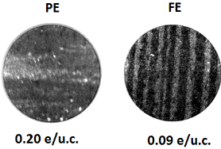
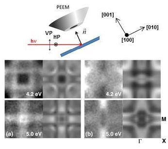

**An ideal ferroelectric (FE) must be an insulator to show a spontaneous polarization, however, recent theoretical and some experimental work suggests that a ferroelectric state can exist up to a certain critical doping level. Thus the possibility of coexistence of ferroelectricity and d electron occupancy opens the way to fascinating properties such as intrinsic multiferroicity, or field-induced metal to insulator transitions. Further progress in this field requires knowledge of the electronic structure which makes the decisive contribution to such functional properties.**

The objective of this work was to quantify the critical doping level and then to investigate the polarization dependence of the band structure at the surface of the doped ferroelectric domains. The Energy-filtered PhotoEmission Electron Microscope (PEEM) at NanoESCA beamline is an ideal tool to investigate in a single experiment the FE domain distribution by imaging the photoemission threshold, the momentum-resolved electronic properties using reciprocal space PEEM and the spatially-resolved chemical states micron-sized regions.
The n-type doping of a BaTiO3(001) single crystal was controlled by annealing in vacuum (creating oxygen vacancies increasing the conductivity) or in oxygen (healing the vacancies, making the sample more insulating). At a doping level of 0.20 electrons/unit cell, the PEEM threshold image is uniform, corresponding to a constant surface potential typical of the paraelectric phase, whereas at 0.09 e/u.c. the threshold PEEM shows the appearance of an ordered stripe-domain phase typical of the ferroelectric phase (Figure 1).

  {.center}

__Figure 1. Threshold photoemission PEEM images showing a paraelectric (PE) to ferroelectric (FE) transition when going from 0.2 to 0.09 e/u.c. doping.__

Careful analysis of the spatially-resolved threshold PEEM patterns shows that the large stripes contain in fact both out-of- and in-plane FE polarized domain structures. To explore the ferroelectric polarization dependence of the band structure we have exploited linear dichroism in reciprocal space PEEM imaging. Sensitivity is maximum when the light polarization is parallel to the ferroelectric polarization. Thus by switching between vertical and horizontal linear light polarization we can probe the band structure from the out-of- and in-plane ferroelectric domains, respectively. Depending on the photon polarization, we observe a 4-fold (vertical light polarization) or 2-fold (horizontal light polarization) symmetry in the experimental band structure (Figure 2. Left-hand panels). From symmetry, the 2-fold (4-fold) symmetry is associated with in-plane (out-of-plane) domain respectively. Density Functional Theory band structure calculations for in- and out-of- plane polarized BaTiO3 show excellent agreement with the experimental k-resolved PEEM images (Figure 2, right-hand panels).

  {.center}

__Figure 2: Top: schematic of the experimental geometry showing the direction of the linearly polarized light with respect to the crystallographic orientation. Main: constant energy cuts in the first Brillouin zone at 4.2 (upper) and 5.0 eV (lower) of the k-PEEM data using (a) VP and (b) HP light. The right-hand panels show the DFT theoretical calculations.__  

###Link to Publication
---

__J. E. Rault, J. Dionot, C. Mathieu, V. Feyer, C. M. Schneider, G. Geneste, N. Barrett__  
*Polarization sensitive surface band structure of doped BaTiO3(001)*  
[*Physical Review Letters* **111**, 127602 (2013)](http://prl.aps.org/abstract/PRL/v111/i12/e127602) - [Pre-Print](https://arxiv.org/abs/1806.03739)

###Link to Highlights
---

This highlight was published on ELETTRA [website](http://www.elettra.trieste.it/science/top-stories/polarization-sensitive-surface-band-structure.html) and also [here](http://www.elettra.trieste.it/lightsources/elettra/elettra-beamlines/nanoesca/example-nanoesca.html).
