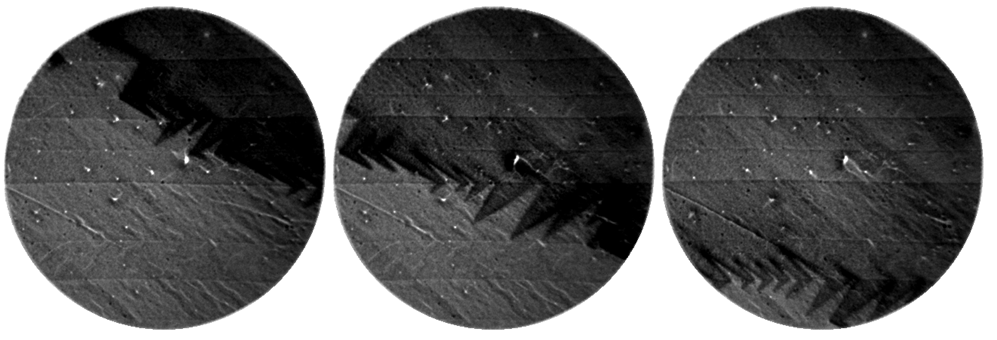

**Control of polarization is a key issue in research on ferroelectrics materials and its possible use for low-consumption electronic devices. A ferroelectric material spontaneously show microscopic domains with different polarization directions to minimize its energy. We showed very low energy electrons generated using a Low Energy Electron Microscope (LEEM) can switch the ferroelectric polarziation in a reversible manner. The use of external charges (here electrons) to alter ferroelectric polarization gives a new direction to functionalize ferroelectric oxides.**

Link to Publication
---

__J. E. Rault, T. O. Mentes, A. Locatelli, N. Barrett__  
*Reversible switching of in-plane polarized ferroelectric domains in BaTiO3(001) with very low energy electrons*  
[*Scientific Reports* **4**, 6792 (2014)](http://www.nature.com/srep/2014/141030/srep06792/full/srep06792.html) (Open Access)

Link to Highlights
---

This highlight was published on CEA [website](http://iramis.cea.fr/spec/Phocea/Vie_des_labos/Ast/ast.php?t=fait_marquant&id_ast=2455) in French.
