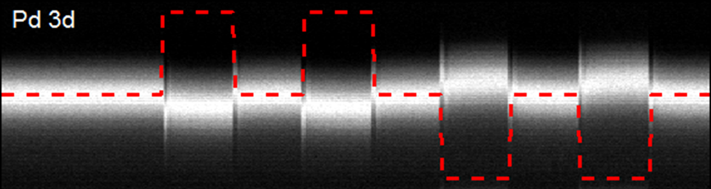

**Ferroelectric devices could be an alternative to magnetic based memories for future high-density data storage. Such devices have considerable advantages: they are non-volatile, have fast read-write times, low energy consumption and use realistic voltages. However, before considering future applications based on such materials, a better understanding of the electronic properties of nanometer-thick ferroelectric films is necessary. As this characterization is often impossible with standard techniques, we have studied ultra-thin films of ferroelectric materials on the TEMPO beamline, using classic and time-resolved photoelectron spectroscopy, an ideal tool for this kind of analysis.**

In a ferroelectric device the local electric polarization is used to store information, either directly (FeRAMS) or by controlling another binary material state (resistive memories) [1]. The defining property of a ferroelectric (FE) material is a spontaneous macroscopic polarization which can be reversed under an applied electric field. Switching the polarization of such films requires a metallic contact, raising fundamental issues on the behavior of the interface between the FE layer and the electrode. The polarization leads to fixed charge of opposite sign at the two metal-FE interfaces. Free charge carriers in the metal electrodes act to screen the polarization charge, however, the screening is usually imperfect and the residual depolarizing field inside the FE alters the electrostatic potential and can even suppress FE polarization below the so-called critical thickness [2].

## In-operando PhotoEmission Spectroscopy ##

The key to better understand these systems is to probe their chemical and electronic properties under realistic operating conditions, i.e. application of d.c. or a.c. bias in the case of a ferroelectric. We developed a new experimental setup to allow such in-operando photoemission spectroscopy both in static and dynamic operations at TEMPO beamline. The starting point is a Pt/BaTiO3/SrTiO3:Nb heterostructure (Pt/BTO/NSTO) grown by Molecular Beam Epitaxy. Electrodes 300 × 300 μm² in area and 3 nm thick were patterned by ion beam etching. Thicker palladium pads overlapping part of the Pt electrodes were deposited to enable wire-bonding of the top electrodes for biasing. A highly insulating layer of Al2O3 was deposited onto bare BTO to suppress interference of the Pd pads with the capacitance (Figure 1a). At the TEMPO beamline, the 100 × 100 µm² beam could be directed onto a single top electrode located by a map of the whole sample using the Pt absorption edge (Figure 1b).

  {.center}

__Figure 1: (a) Schematic of the capacitor; (b) Pt 4f intensity map for the Pt/BTO/NSTO sample showing 20 identical Pt/BTO/NSTO capacitors (300x300 µm²) on the 5x5 mm² surface, allowing location of the wired capacitor.__

## Electronic response to polarization switching at Pt/BaTiO3 interface ##

Using this innovative setup, we directly measured the energy band alignment of the Pt/BTO interface as a function of the ferroelectric polarization. In the P+ state (FE polarization towards Pt), the structure can be modeled as back-to-back diodes showing Schottky-limited conduction. The experimental conduction-band offset is 0.40 eV at the Pt/BTO interface and 0.45 eV at the BTO/NSTO interface. In the P- state (FE polarization towards NSTO), the top interface band alignment remains Schottky-like (+0.90 eV) while at the bottom interface (BTO/NSTO) the conduction band offset reduces to zero leading to ohmic conduction, consistent with the current – voltage characteristic of the whole structure. The observed barrier heights depend on both the interface chemistry and the FE polarization [3].

Using the time-resolved detection system available at TEMPO beamline, the photoemission response of the capacitor to polarization switching induced by square voltage pulses has been measured. An equivalent circuit model has been developed which compares well with the photoemission response of the system (Figure 2). This shows the potential of time-resolved photoemission spectroscopy to follow the chemical/electronic changes in working model microelectronic devices, here a ferroelectric capacitor [4].

  {.center}

__Figure 2: (a) Time-dependent evolution of the binding energy (BE) shifts for the Pd 3d5/2 (blue circles), Pt 4f7/2 (green squares) and results of the electrical simulations (solid lines) for the two core-levels. The blue dotted curve shows the pulse train applied on the top electrode; (b) Equivalent circuit model used to fit the experimental data to theoretical simulations.__

Electronic pump with synchrotron based XPS probe is the ideal tool and appears well-suited to the time-resolved capabilities of TEMPO. The next step is in-operando pump-probe measurements of the electron dynamics of the switch, focusing on the response of the ferroelectric near the electrode interface.

__References:__

[1] M. Dawber et al., *Review of Modern Physics* **77**, 1083 (2005).  
[2] J. Junquera and P. Ghosez, *Nature* **422**, 506 (2003).  
[3] J. E. Rault et al. *Physical Review B* **87**, 155146 (2013).  
[4] J. E. Rault et al. *Physical Review B* 2013 **88**, 155107 (2013).  

Link to Publication
---

__J. E. Rault, G. Agnus, T. Maroutian, V. Pillard, Ph. Lecoeur, G. Niu, B. Vilquin, M. G. Silly, A. Bendounan, F. Sirotti, N. Barrett__  
*Time-resolved photoemission spectroscopy on a metal/ferroelectric heterostructure*  
[*Physical Review B* **88**, 155107 (2013)](https://journals.aps.org/prb/abstract/10.1103/PhysRevB.88.155107) - [Pre-Print](https://arxiv.org/abs/1307.3769)

__J. E. Rault, G. Agnus, T. Maroutian, V. Pillard, Ph. Lecoeur, G. Niu, B. Vilquin, M. G. Silly, A. Bendounan, F. Sirotti, N. Barrett__  
*Interface Electronic Structure in a Metal/Ferroelectric Heterostructure under Applied Bias*  
[*Physical Review B* **87**, 155146 (2013)](http://prb.aps.org/abstract/PRB/v87/i15/e155146) - [Pre-Print](https://arxiv.org/abs/1302.4603)

Link to the Highlight
---

This highlight was published on Synchrotron SOLEIL [2013 highlights](http://www.highlights-synchrotron-soleil.fr/Highlights-2013-booklet/#28/z).
