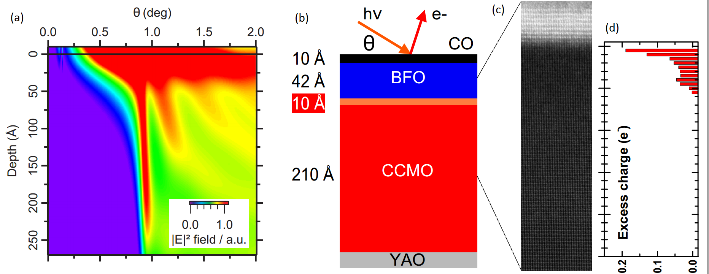
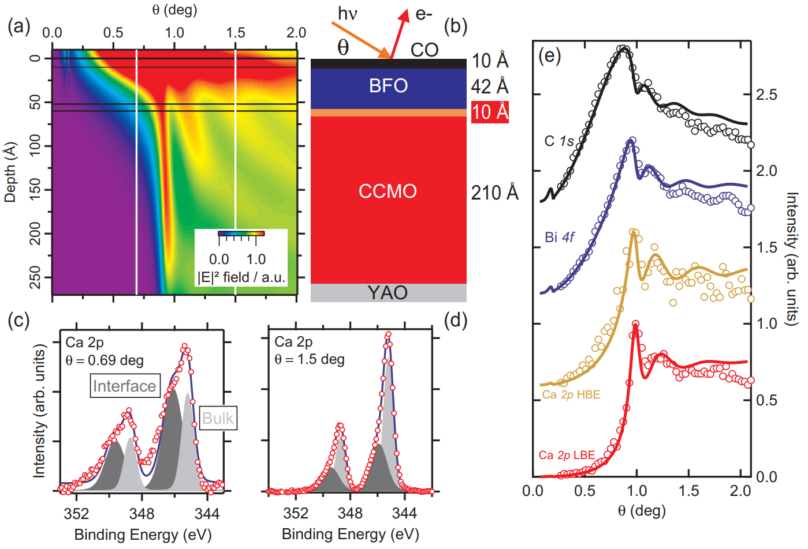

**Ferroelectric memories - in which information is coded within the direction of the electric polarization – are energy saving, durable and very fast electronic devices already commercially available. However, reading the information necessitates an auxiliary electronic circuit which limits the miniaturization of such systems at the nanometric scale. Researchers are thus looking towards systems where ferroelectric polarization allows manipulating the physical binary state of an oxide, easier to decode. But how the interface between the ferroelectric and the oxide behaves remain poorly known, which limits our understanding of the real abilities of these devices. A study led by scientists from the GALAXIES beamline at SOLEIL, the ALS synchrotron in Berkeley, the laboratoire Physique du Solide d’Orsay and the Unité Mixte de Physique CNRS/THALES de Palaiseau, has recently been published in Nano Letters, and presents a novel way to characterize these interfaces.**

A ferroelectric material has got at least two stable states of remnant electric polarization and an electric field can be used to switch from one state to the other. It soon appeared that the material could be used to store information with several assets: it is handled with a low electric voltage (1-2volts), has potentially high rates (a few GHz), it is nonvolatile and has an excellent endurance to read/write cycles (at least 10^12 cycles). Such memories are commercialized now, and equip for example game consoles and scientific calculators. However, the reading of binary information in these memories necessitates an additional micrometric device, which on one hand suppresses the information to be rewritten (“destructive readout”), and on the other hand limits the miniaturization of such systems at the nanometric scale.

Research is now focusing on other methods to exploit the interesting properties of ferroelectrics in electronic devices made of a stack of ultra-thin layers, i.e. with a thickness beneath a few nanometers. Following the idea developed by the Nobel Prize Laureate Herbert Kroemer –whereby « interface is the device » [1] -, the principle is to exploit the local polarization effect of a thin ferroelectric layer at the interface with another layer exhibiting interesting charge transport or electronic spin properties. For example, it has been demonstrated that ferroelectric polarization could alter the magnetic properties of an adjacent thin layer, paving the way for spin electronics without any magnetic field [2]. On the basis of the architecture of traditional field effects transistors, our collaborators from the Unité Mixte de Physique CNRS/Thalès, showed that the orientation of the ferroelectric polarization can drastically modify the conduction properties of the adjacent oxide [3], which is the first step towards nanometric logical doors based on ferroelectrics.

**Near-total Reflection hard x-ray PhotoEmission Spectroscopy**

These systems are rather well characterized at the macroscopic scale. Yet, to go further in their understanding and to be able to predict and produce more efficient systems, it is necessary to reach a precise characterization of their chemical and electronic properties, especially at the interface between the two materials.

On the GALAXIES beamline, we have developed a new method of hard x-ray PhotoEmission Spectroscopy exploiting the properties of photons that hit a sample at grazing incidence, giving access to depth-resolved information. The idea consists in using photon interferences in the sample, to selectively probe different depths of a heterogeneous structure. Until this publication, the technique had only been used on super lattices [4]. For the first time we applied it on a structure made of two thin layers deposited on a substrate by using the near total-reflection grazing incidence photons interferences. In the study, a 5nm thin layer of ferroelectric, the BiFeO3 (BFO), was deposited by laser ablation on a 20 nm thin layer of (Ca,Ce) MnO3 (CCMO). The whole was then deposited on a YAlO3 substrate, as shown on figure 1b. CCMO is a semiconductor extremely sensitive to the BFO polarization, and it can switch from a conducting state to an insulating one whenever polarization is reversed. The interface (in orange on figure 1b) is expected to be responsible for this spectacular effect, but it has not been directly demonstrated with a microscopic analysis [5].

Figure 1a presents the result of theoretical calculation of depth and intensity distribution of the X photon field in the system shown in figure 1b. The results shows that the more the incident angle increases, the deepest X-rays penetrate the system, thus allowing a depth-resolved analysis of the system. The analysis of photoelectrons coming from the CCMO thin layer calcium exhibits an electron-rich area 1 nm thick at the interface between BFO and CCMO. This electron accumulation area is generated by the negative polarization of BFO and results to the CCMO layer macroscopic conduction. This results perfectly match the ones of our collaborators of the Laboratoire de Physique du Solide (Orsay, France) using scanning and transmission electron microscopy, which show a higher electron rate on the first two unit cells of CCMO at the interface with the ferroelectric BiFeO3 (Figure 1c-d).

  {.center}

__Figure 1: (a) Theoretical calculation of the intensity of the photon field inside the sample as a function of the beam incidence, (b) Schematic description of a system made of a thin ferroelectric layer BiFeO3 (in blue), an interface area (orange), a thin layer of (Ca,Ce)MnO3 (red) and a substrate of YAlO3 (grey) and (c) Imaging of the structure with transmission electron microscopy. (d) Electron repartition in the system as a function of depth.__

__References:__  

[1] H. Kroemer Nobel [lecture](http://www.nobelprize.org/nobel_prizes/physics/laureates/2000/kroemer-lecture.pdf) (2000).  
[2] Garcia, V. et al., *Science* **327**, 1106–1110 (2010).  
[3] Boyn, S. et al., *Applied Physics Letters* **104**, 052909 (2014).  
[4] Gray, A. X. et al., *Phys. Rev. B* **82**, 205116 (2010) and Döring, S. et al., *Physical Review B* **83**, 165444 (2011).  
[5] Yamada, H. et al., *Scientific Report* **3**, 2834 (2013).  

Link to Publication
---

__M. Marinova, J. E. Rault, A. Gloter, S. Nemsak, G. K. Palsson, J.-P. Rueff, C. S. Fadley, C. Carrétéro, H. Yamada, K. March, V. Garcia, S. Fusil, A. Barthélémy, O. Stéphan, C. Colliex and Manuel Bibes__  
*Depth Profiling Charge Accumulation from a Ferroelectric into a Doped Mott Insulator*  
[*Nano Letters* **15**, 2533–2541 (2015)](http://pubs.acs.org/doi/abs/10.1021/acs.nanolett.5b00104) - [Pre-Print](https://arxiv.org/abs/1708.09160)

Link to Highlights
---

This highlight was published on Synchrotron SOLEIL [website](https://www.synchrotron-soleil.fr/en/news/characterization-electronic-properties-functionalized-oxides-interface).

This work was the also described by __Rachel Berkowitz (LBNL)__ in this [short news](https://newscenter.lbl.gov/2015/06/10/investigating-buried-interfaces-in-ferroelectric-materials/).
