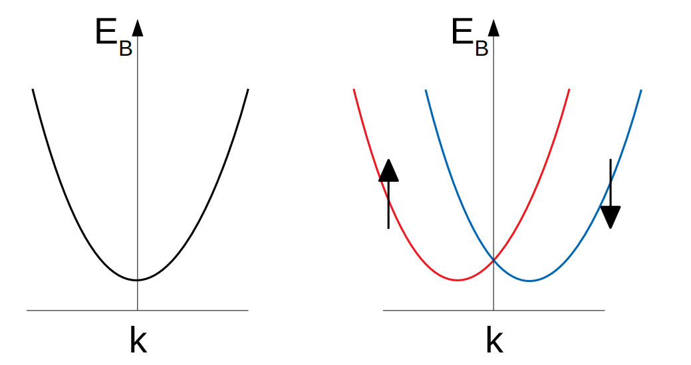
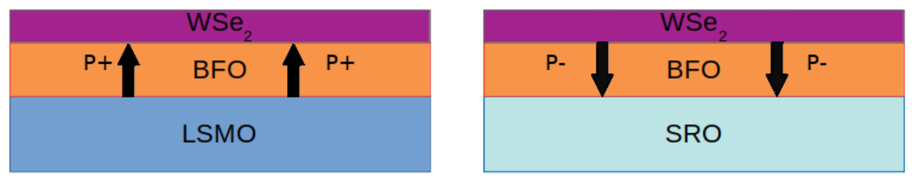
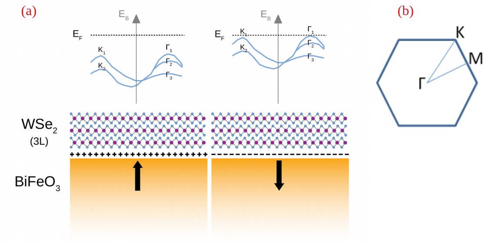
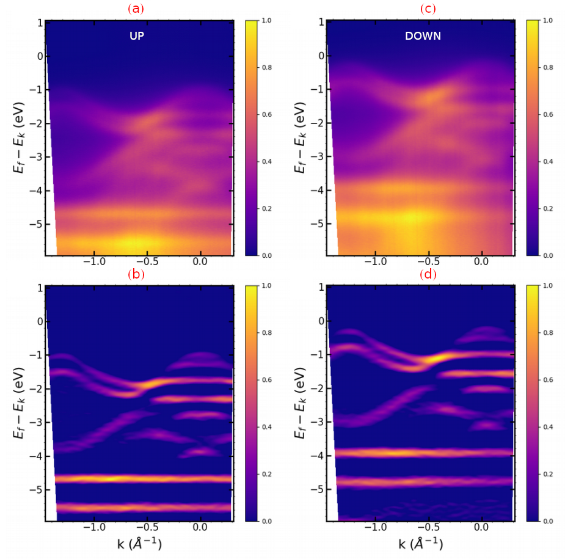

**In spite of pandemic-related delays in every aspects of the projects (samples fabrication, beamtime cancellation, delayed analysis), we managed to do a comprehensive study of WSe2/BiFeO3 heterostructure during the first semester of 2020. This was the result of nice work from our collaborators from CEA-LETI (C. Vernaud, M. Jammet) and UMPhys CNRS/Thales (S. Varotto, V. Garcia, M. Bibes) and C2N (J. Chaste, T. Maroutian, A. Ouerghi) and a successful beamtime at Cassiopée in July 2020. This page shows a quick summary of these measurements that will be soon published.**

## Context
2D Transition metal dichalcogenides (TMD) can present anisotropic Rashba spin-splitting when subjected to an electric field. In this work we use the permanent polarisation of a ferroelectric to achieve reach this goal. We aim to measure the band structure of of a few layer TMD – ferroelectric heterostructure and bring direct evidence of the spin-splitting using angle resolved photoemission spectroscopy.

Rashba effect is a result of the spin-orbit interaction in solids that emerges whenever there is a structural inversion asymmetry in a crystal as it is the case with a reduction of dimensionality. It is similar to other spin-orbit related effects such as Dresselhaus effect which is active when the crystal structure lacks inversion symmetry. In two dimensional electron gases it has the effect of splitting the bands into spin-polarised bands with separate momenta as pictured in figure 1. The use of an external electric field can further enhance the effect as the spin-orbit interaction is largely dependent on the total electric field at a given point of space.

  {.center}

__Figure 1: Rashba spin splitting in a 2DEG, the parabolic bands are separated in impulsion and spin polarisation__  

## Samples

We studied heterostructures of trilayer tungsten diselenide (WSe2) and thin-film (~ 30 µm) bismuth ferrite (BiFeO3/BFO). Two high crystalline ferroelectric thin films of BFO (001), were prepared by our collaborators at Unité Mixte CNRS Thalès using pulsed laser deposition (PLD). The first was grown on a SrRuO3 (SRO) metallic electrode and the other on a LaxSr1-xMnO3 (LSMO). Both electrodes had previously been grown on DyScO3 (110) substrates. We obtained with this method two monodomain thin film ferroelectric substrates, with respectively inward (SRO grown BFO) and outward (LSMO grown BFO) polarisations as resumed in the figure 2. WSe2 films were grown by chemical vapour depositon (CVD) on a mica substrate at CEA Leti. This technique is able to produce large scale films (5mm x 5mm). These films were then wet transferred on the BFO substrates, covering the whole surface. We checked using Piezoresponse Force Microscopy (PFM) that the BFO keeps the same orientation after the transfer process.

  {.center}

__Figure 2: Diagram of the two samples: SRO/LSMO electrode induces down/up polarisation (P-/P+)__

## Polarization-dependent band structure of trilayer WSe2/BFO

  {.center}

__Figure 3: (a) diagram of K-Γ slices of the band structures of trilayer WSe2 on up and down polarised BFO. The bound charges at the surface induce a rigid shift of the band structure of the WSe2. (b) Surface projected Brillouin zone of WSe2.__

We measured the band structure of the trilayer WSe2 using angular resolved photoemission spectroscopy. Measurement showed nicely defined bands and a clear shift between heterostructure with inward and outward polarization as schematized in figure 3 and visible in figure 4. As expected, trilayer WSe2 exhibits a threefold dispersion of its bands at Γ of the Brillouin zone and two spin splitted bands at K. Using a standard second derivative treatment enhances the definition of the bands from which we
extracted E(k) dispersions from which we extracted shifts values. We compute a mean shift from the samples of opposite polarization (up to down) have their energy bands shifted of -0.748 eV (standard deviation 0.03 eV). The spin-orbit splitting Δs-o values we obtain are consistent the literature for trilayer WSe2 with different growing methods (CVD, mechanical exfoliation...). They are slightly higher (0.475 eV) for upward polarization compared to downward (0.460 eV).

  {.center}

__Figure 4: (a)-(b) energy momentum Γ-K slices of WSe2/BFO(up) and WSe2/BFO(down),(e)-(f) second derivative of energy momentum Γ-K slices of WSe2/BFO(up), WSe2/BFO(down). We used hv = 50 eV for all spectra.__

## Discussion

The separation of the bands are nearly identical for all configurations at Γ or K. This suggest a rigid shift of the bands with little to no deformation. The position of the valence band maximum (VBM) could imply that down BFO gives rise to a n semiconductor character whereas up BFO would lead to an intrinsic behaviour. This will be soon studied by transport measurements.
