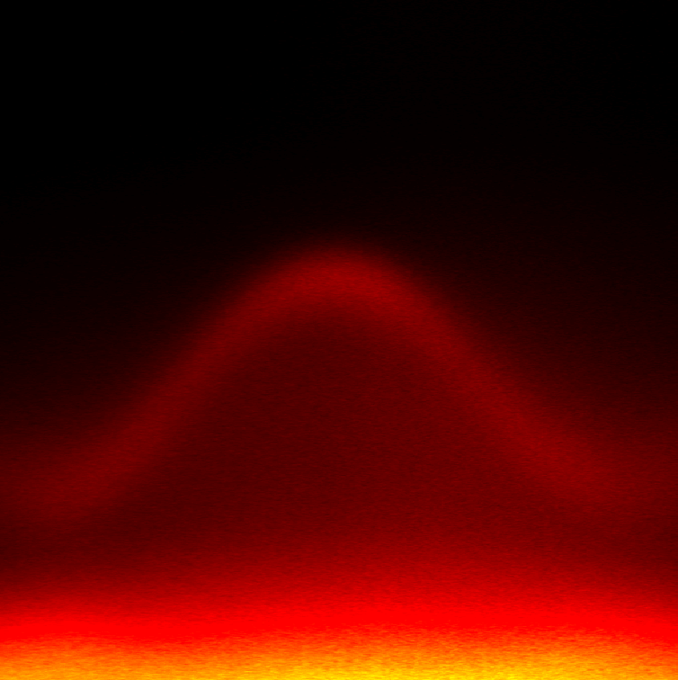
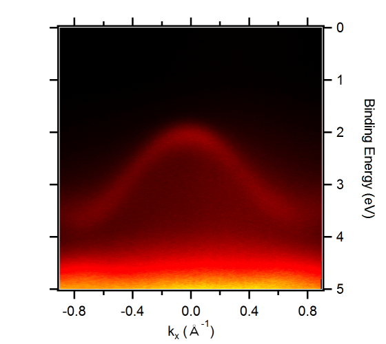

**November 2019 is the official start of the ANR project Cornflake. With the help of Raphaël Salazar, new PhD student of Cassiopée, it aims at understanding better how a ferroelectric polarization can alter the electronic properties of an transition metal dichalcogenides layer. To achieve this goal, the project will combine angle-resolved and spin-resolved photoemission spectroscopy on TMDCs/ferroelectric heterostructures. It will involve many collaborations with laboratories of the Plateau de Saclay (UMPhy CNRS/Thales, C2N, Centrale Paris) and others (CEA-LETI).**

## Context
With charge-based electronics getting to their limits in storage density, speed and energy consumption, spin-based electronics (spintronics) is now a central research topic and promises significant improvements in device performances. Controlling spins with an electric field is a major goal in spintronics since it is an industry-compatible, low-energy-consumption degree-of-freedom to act on an elusive, fundamental property of matter.  Taking advantage of the predicted giant Rashba effect at their interfaces, transition metal dichalcogenides (TMDCs) monolayers gated by a ferroelectric oxide layer can achieve this goal. By combining advanced angle- and spin- resolved photoemission spectroscopy, the CORNFLAKE project aims at a thorough characterization of the spin-split bands of TMDCs deposited on ferroelectric ultrathin films via molecular beam epitaxy. 
This project will give quantitative values for the band energy and momentum spin-splitting as a function of the ferroelectric polarization magnitude and direction. The ultimate goal of the project is to provide a ferroelectric polarization dependent measure of the 3D spin-texture of the TMDCs.  Such knowledge is necessary for a better understanding of gated TMDCs and their potential use in realistic spin devices. Also, by focusing on strong spin-orbit-coupled materials and hybrid interfaces, this project falls within the more general field of Quantum Materials, a fascinating venue to uncover the roles of symmetry, topology, dimensionality and strong correlations in macroscopic observables.

__Figure 1: Typical WS2 band structure measured on a BaTiO3 substrate__  

## Tentative planning

This project started on November 2019, and will last 3.5 years. This will be the core project of Raphaël Salazar, a PhD student from INSA Toulouse.

The first year is devoted to finding a good combination of TMDCs and ferroelectric, and achieve first measurements on clean samples (link to "first results")

The second year will be focused on the full characterization of the heterostructure made during the first year, via ARPES and spin-ARPES. But also a careful examination of the interface properties as a function of sample preparation (growth and post-annealing) will be conducted using XPS and ARPES to understand the influence of interface screening on the heterostructures properties.

The third year aimed at measuring spin-texture on such system. As a perspective, we aim at measuring sample with in-situ bias so we can switch polarization in-situ, or apply a bias sufficient to induce Rashba-splitting without the ferroelectric underlayer.

Significant results will be published in peer-reviewed journals, but some short news will be published on this website during the course of the project.
