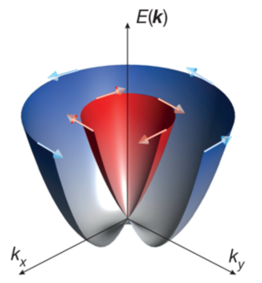

**January 2021 is the official start of the ANR project Contrabass. At the cross-road between spintronics, ferroelectricity and quantum materials physics, CONTRABASS will pioneer a new realm in spintronics, where spin currents can be generated, manipulated and converted by electric fields in a non-volatile way, without resorting to ferromagnets and their energy-costly magnetization switching. It's a collaboration between 5 laboratories: Spintec (CEA), UMPhy (CNRS/THALES), IJL (Uni. Lorraine), Crismat (ENSI CAEN) and Synchrotron SOLEIL.**

## Context
To contain the ever-increasing power consumption of information and communication systems, resorting to ferroic systems with collective switching behavior and non-volatility appears essential, in order to bring memory into logic and to alleviate energy-costly on-chip data transfer . A very active field of research for information processing is spintronics, which has traditionally relied on ferromagnetic metals as generators and detectors of spin currents . A new approach called spin-orbitronics exploits the possibility offered by the spin-orbit coupling (SOC) in non-magnetic systems  to generate pure spin currents from charge currents, and vice versa. In particular, a quantum phenomenon called the Rashba effect allows spin-charge interconversion with great efficiency. Spin-orbitronics memory and logic concepts still involves ferromagnetic elements, whose switching energy far exceeds the requirements of beyond-CMOS technologies. In addition, the way charge and spin are interconverted is inherently set by the stack, without the possibility to tune it by an external stimulus. In contrast with ferromagnets, the order parameter in ferroelectrics (polarization) can be easily switched by an electric field, at a power typically 1000 times lower2. Ferroelectrics have been used in commercial non-volatile data storage for two decades (in FERAMs), and ferroelectric tunnel junctions are now considered as an emerging memory technology in the IRDS roadmap. Importantly, ferroelectrics can induce large charge accumulation/depletion in adjacent materials, which modifies their properties in a non-volatile fashion , . Combined with high SOC elements, they have a natural potential to generate a strong Rashba SOC that would be electrically switchable. Ferroelectric Rashba architectures thus offer a new approach to control spin currents by electric fields, beyond magnetoelectric switching with multiferroics whose potential for robust, high-endurance magnetization switching remains elusive despite 15 years of intense efforts, but retaining its ultralow operating power. 

## Tentative planning

This project started on January 2021, and will last 3.5 years. At Casssiopee, we will characterize the spin-resolved band structure of ferroelectric/Rashba materials heterostructures. We will developp a way to apply voltages in-situ so we can obtain easily polarization-dependent band structures, hence have a thorough undertanding of such complex systems.

Significant results will be published in peer-reviewed journals, but some short news will be published on this website during the course of the project.
