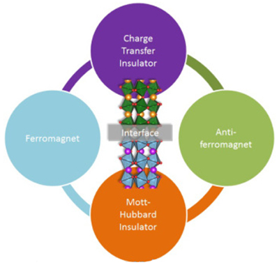

**Cuprates (copper oxides) are currently used as highest temperature (-135° C) superconductors. Scientists are trying to find new candidates for which this temperature would be even higher. This involves understanding in detail the electronic mechanisms involved between the elements composing the superconductor.**  

Theoretical calculations predict a possible superconducting character in other oxides, nickelates, that have been studied by an international team of researchers from the UMP CNRS/Thales (Univ. Paris-Saclay), the Complutense University of Madrid and the Helmholtz-Zentrum Berlin. Their research focuses specifically on the electronic and magnetic properties at the interface between the layers forming this type of material. Their results, obtained notably on the GALAXIES beamline, identify the level of covalence in the atomic bonds as key to adjusting the properties of the interface and reveal a new magnetic state.

  {.center}

###Link to Publication
---

__M. N. Grisolia, J. Varignon, G. Sanchez-Santolino, A. Arora, S. Valencia, M. Varela, R. Abrudan, E. Weschke, E. Schierle, J. E. Rault, J.-P. Rueff, A. Barthélémy, J. Santamaria and M. Bibes__  
*Hybridization-controlled charge transfer and induced magnetism at correlated oxide interfaces*  
[*Nature Physics* **12**, 484–492 (2016)](http://www.nature.com/nphys/journal/v12/n5/abs/nphys3627.html) - [Pre-Print](https://arxiv.org/abs/1708.08823)

###Link to the Highlight
---

This highlight was published on Synchrotron SOLEIL [website](https://www.synchrotron-soleil.fr/en/news/superconductivity-and-nickelates).

