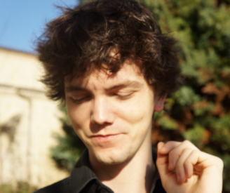

About Me
---

Since 2014, I've been working as a beamline Scientist at the [CASSIOPEE](https://www.synchrotron-soleil.fr/en/beamlines/cassiopee) beamline ([Synchrotron SOLEIL](https://www.synchrotron-soleil.fr/en)).

Here is my Google Scholar's profile :  

  

**Research topics:**

* Ferroelectric (FE) and multiferroïc oxides
  
  * Electronic response to FE polarization at metal/ferroelectric interfaces (Pt/BaTiO3, SrRuO3/BaTiO3)
    * Polarization magnitude at very thin FE film thicknesses (BiFeO3 ultrathin films)
    * Ferroelectric to paraelectric transition in conducting ferroelectrics (BaTiO3 single crystals)
    * Polarization-dependent band structure (BaTiO3 single crystals)  

* Highly-correlated oxides
 
    * Mottronics (Irridates, vanadates, nickelates)
    * Strong spin-orbit coupling 2D materials coupled to ferroelectrics

* Techniques

    * Soft, hard x-ray (angle-resolved) photoemission spectroscopy (XPS, HAXPES, ARPES, HARPES)
    * Soft x-ray photoemission electron microscopy in real and reciprocal spaces (PEEM, k-PEEM)
    * Standing wave (angle-resolved) photoemission spectroscopy (SW-XPS, SWARPES)

CV
---

**2014 - now:** Beamline scientist at the [CASSIOPEE](https://www.synchrotron-soleil.fr/en/beamlines/cassiopee) beamline ([Synchrotron SOLEIL](https://www.synchrotron-soleil.fr/en)).  
**2013 - 2014:** Post-doctoral position at the [GALAXIES](http://www.synchrotron-soleil.fr/Recherche/LignesLumiere/GALAXIES) beamline ([Synchrotron SOLEIL](https://www.synchrotron-soleil.fr/en)) and [Fadley's group](http://www.physics.ucdavis.edu/fadleygroup/) at [Lawrence Berkeley National Laboratory](http://www.lbl.gov/).  
**2010 - 2013:** PhD graduate of the [Université Pierre et Marie Curie](http://www.upmc.fr/) in Physics. The thesis has been conducted at the [Photoemission, Photodiffraction and Spectromicroscopy group](http://iramis.cea.fr/spec/Phocea/Vie_des_labos/Ast/ast_visu.php?id_ast=2075) in CEA-Saclay.  
**2006 - 2009:** Graduate of Ecole Centrale Paris (P2009) in Applied Physics.  

Contact Me
---
pro at juer.fr
